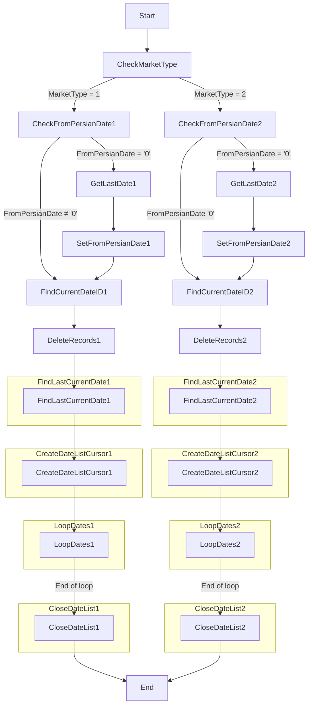

```mermaid
graph TD;
  Start --> CheckMarketType;
  CheckMarketType --> |MarketType = 1| CheckFromPersianDate1;
  CheckFromPersianDate1 --> |FromPersianDate = '0'| GetLastDate1;
  CheckFromPersianDate1 --> |FromPersianDate ≠ '0'| FindCurrentDateID1;
  GetLastDate1 --> SetFromPersianDate1;
  SetFromPersianDate1 --> FindCurrentDateID1;
  FindCurrentDateID1 --> DeleteRecords1;
  DeleteRecords1 --> FindLastCurrentDate1;
  FindLastCurrentDate1 --> CreateDateListCursor1;
  CreateDateListCursor1 --> LoopDates1;
  LoopDates1 --> |End of loop| CloseDateList1;
  CloseDateList1 --> End;

  CheckMarketType --> |MarketType = 2| CheckFromPersianDate2;
  CheckFromPersianDate2 --> |FromPersianDate = '0'| GetLastDate2;
  CheckFromPersianDate2 --> |FromPersianDate  '0'| FindCurrentDateID2;
  GetLastDate2 --> SetFromPersianDate2;
  SetFromPersianDate2 --> FindCurrentDateID2;
  FindCurrentDateID2 --> DeleteRecords2;
  click FindCurrentDateID2 "https://google.com"
  DeleteRecords2 --> FindLastCurrentDate2;
  FindLastCurrentDate2 --> CreateDateListCursor2;
  CreateDateListCursor2 --> LoopDates2;
  LoopDates2 --> |End of loop| CloseDateList2;
  CloseDateList2 --> End;

  subgraph sub_FindLastCurrentDate1[FindLastCurrentDate1]
    FindLastCurrentDate1
  end

  subgraph sub_CreateDateListCursor1[CreateDateListCursor1]
    CreateDateListCursor1
  end

  subgraph sub_LoopDates1[LoopDates1]
    LoopDates1
  end

  subgraph sub_CloseDateList1[CloseDateList1]
    CloseDateList1
  end

  subgraph sub_FindLastCurrentDate2[FindLastCurrentDate2]
    FindLastCurrentDate2
  end

  subgraph sub_CreateDateListCursor2[CreateDateListCursor2]
    CreateDateListCursor2
  end

  subgraph sub_LoopDates2[LoopDates2]
    LoopDates2
  end

  subgraph sub_CloseDateList2[CloseDateList2]
    CloseDateList2
  end

```
